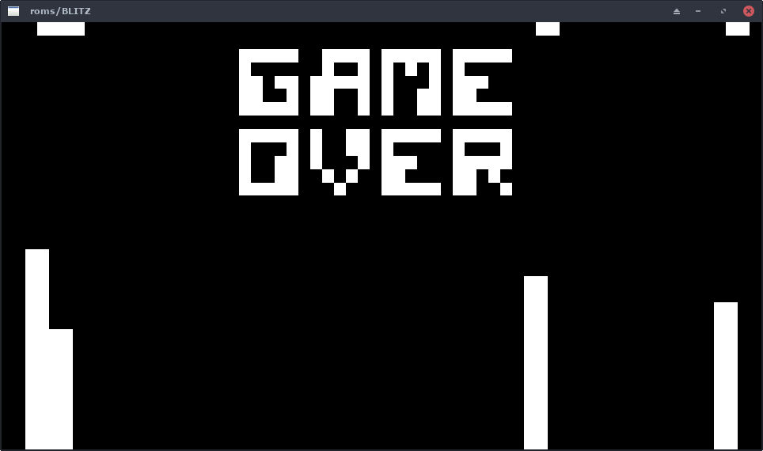

# Chip8 Emulator Lib and SDL Frontend

Public domain roms obtained from:
https://www.zophar.net/pdroms/chip8.html

## Building and Running

```
meson setup --buildtype release build
ninja -C build
./build/front/chip8 roms/TICTAC
```

Let it be known: There are bugs.



## Input

Use the `Esc` key to quit the emulator.
Use the `F11` key to toggle borderless fullscreen.

The CHIP-8 uses a 4x4 keypad for input.
These keys are mapped to:
```
1234
QWER
ASDF
ZXCV
```
On non-QUERTY keyboards, these keys should still be mapped to the same physical position.

## TODO
- [] Test on Mac and Windows.
- [] Add sound support.
- [] Add commandline options.
- [] Fix emulator bugs.
